# Azure Cheat Sheet (Beginner → Expert)

> A practical reference covering Azure CLI, PowerShell, core services, resource management, networking, storage, compute, identity, monitoring, automation, security, and best practices.

---

## Table of Contents

1. Introduction & Setup
2. Azure CLI & PowerShell Basics
3. Resource Groups & Resource Management
4. Compute (VMs, Scale Sets, Functions, AKS)
5. Networking
6. Storage
7. Databases & Data Services
8. Identity & Access Management (IAM)
9. Monitoring & Logging
10. Automation (ARM, Bicep, Terraform)
11. Security & Governance
12. Cost Management
13. Useful CLI & PowerShell Commands

---

# 1. Introduction & Setup

**What is Azure?**

* Microsoft’s cloud platform offering compute, storage, networking, identity, AI, DevOps, and more.

**Install tools**

```bash
# Azure CLI (cross-platform)
curl -sL https://aka.ms/InstallAzureCLIDeb | sudo bash

# Login
az login

# Set default subscription
az account set --subscription "MySubscription"
```

PowerShell:

```powershell
Install-Module -Name Az -AllowClobber -Scope CurrentUser
Connect-AzAccount
```

---

# 2. Azure CLI & PowerShell Basics

**CLI**

```bash
az account show
az group list
az vm list -o table
```

**PowerShell**

```powershell
Get-AzSubscription
Get-AzResourceGroup
Get-AzVM
```

**Output formats**

* JSON (default), table, tsv, yaml.

```bash
az vm list -o table
```

---

# 3. Resource Groups & Resource Management

**CLI**

```bash
az group create --name myRG --location eastus
az group list -o table
az group delete --name myRG
```

**PowerShell**

```powershell
New-AzResourceGroup -Name myRG -Location eastus
Get-AzResourceGroup
Remove-AzResourceGroup -Name myRG
```

---

# 4. Compute

**Virtual Machines (VMs)**

```bash
az vm create \
  --resource-group myRG \
  --name myVM \
  --image UbuntuLTS \
  --admin-username azureuser \
  --generate-ssh-keys

az vm start --name myVM --resource-group myRG
az vm stop --name myVM --resource-group myRG
```

PowerShell:

```powershell
New-AzVM -ResourceGroupName myRG -Name myVM -Image UbuntuLTS
Start-AzVM -Name myVM -ResourceGroupName myRG
Stop-AzVM -Name myVM -ResourceGroupName myRG
```

**Scale Sets**

```bash
az vmss create --resource-group myRG --name myScaleSet --image UbuntuLTS
```

**Functions**

```bash
az functionapp create --resource-group myRG --consumption-plan-location eastus --runtime python --functions-version 4 --name myFuncApp --storage-account mystorageacct
```

**AKS (Kubernetes)**

```bash
az aks create --resource-group myRG --name myCluster --node-count 3 --enable-addons monitoring --generate-ssh-keys
az aks get-credentials --resource-group myRG --name myCluster
```

---

# 5. Networking

**Virtual Network & Subnet**

```bash
az network vnet create --name myVnet --resource-group myRG --subnet-name mySubnet
```

**Public IP**

```bash
az network public-ip create --resource-group myRG --name myPublicIP
```

**NSG (Network Security Group)**

```bash
az network nsg create --resource-group myRG --name myNSG
az network nsg rule create --resource-group myRG --nsg-name myNSG --name AllowSSH --priority 1000 --access Allow --protocol Tcp --destination-port-ranges 22
```

---

# 6. Storage

**Storage account**

```bash
az storage account create --name mystorageacct --resource-group myRG --location eastus --sku Standard_LRS
```

**Blob container**

```bash
az storage container create --account-name mystorageacct --name mycontainer --auth-mode login
```

**File share**

```bash
az storage share create --name myshare --account-name mystorageacct
```

---

# 7. Databases & Data Services

**Azure SQL Database**

```bash
az sql server create --name mydbserver --resource-group myRG --location eastus --admin-user adminuser --admin-password P@ssw0rd123
az sql db create --resource-group myRG --server mydbserver --name mydatabase --service-objective S0
```

**Cosmos DB**

```bash
az cosmosdb create --name mycosmos --resource-group myRG --kind MongoDB
```

**Azure Storage Table**

```bash
az storage table create --account-name mystorageacct --name mytable
```

---

# 8. Identity & Access Management (IAM)

**Users & Roles**

```bash
az ad user create --display-name "Bob" --user-principal-name bob@contoso.com --password "P@ssword123!"
az role assignment create --assignee bob@contoso.com --role "Contributor" --resource-group myRG
```

**Service Principals**

```bash
az ad sp create-for-rbac --name myApp --role Contributor --scopes /subscriptions/<SUB_ID>/resourceGroups/myRG
```

---

# 9. Monitoring & Logging

**Azure Monitor metrics**

```bash
az monitor metrics list --resource <resourceID> --metric Percentage CPU
```

**Activity logs**

```bash
az monitor activity-log list --resource-group myRG --max-events 5
```

**Log Analytics query**

```bash
az monitor log-analytics query --workspace <workspaceID> --analytics-query "AzureActivity | take 10"
```

---

# 10. Automation (ARM, Bicep, Terraform)

**ARM template deployment**

```bash
az deployment group create --resource-group myRG --template-file template.json
```

**Bicep deployment**

```bash
az deployment group create --resource-group myRG --template-file main.bicep
```

**Terraform**

```bash
terraform init
terraform plan
terraform apply
```

---

# 11. Security & Governance

**Policies**

```bash
az policy definition list
az policy assignment create --name denyPublicIP --policy "DenyPublicIP" --scope /subscriptions/<SUB_ID>
```

**Key Vault**

```bash
az keyvault create --name myKeyVault --resource-group myRG --location eastus
az keyvault secret set --vault-name myKeyVault --name MySecret --value "supersecret"
```

**Azure Defender**

* Security alerts and threat protection.

---

# 12. Cost Management

**View costs**

```bash
az consumption usage list --start-date 2023-01-01 --end-date 2023-01-31
```

**Budgets**

```bash
az consumption budget create --amount 100 --time-frame Month --name MyBudget --category cost --start-date 2023-01-01 --end-date 2023-12-31 --resource-group myRG
```

---

# 13. Useful CLI & PowerShell Commands

**CLI**

```bash
az login
az group list -o table
az vm list -o table
az storage account list -o table
az aks list -o table
```

**PowerShell**

```powershell
Connect-AzAccount
Get-AzResourceGroup
Get-AzVM
Get-AzStorageAccount
Get-AzAksCluster
```

---

# Quick Reference: One-liners

* List all resource groups:

```bash
az group list -o table
```

* Start all VMs in a resource group:

```bash
az vm start --ids $(az vm list -g myRG --query "[].id" -o tsv)
```

* Delete all resources in a group:

```bash
az group delete --name myRG --yes --no-wait
```

* List role assignments:

```bash
az role assignment list -o table
```


----
## 🔐 Securing APIs with APIM, App Registrations, and Managed Identity

These four components are central to securing APIs in Azure, especially when using Azure API Management (APIM).

| Component | Primary Role in API Security | Use Cases |
|---|---|---|
| 📱 **App Registration (Microsoft Entra ID)** | Represents an application that interacts with the Microsoft identity platform. It defines the application's identity, permissions (scopes/roles), and authentication details (secrets/certificates). | **External Clients/Users (Client-to-APIM):** Used to define the API itself (as a resource) and for client applications to get a token to call the API Gateway. <br> **Legacy/Non-Azure Backends:** Used to secure backends that require a service principal (with a client secret/certificate) for authentication. |
| 🤖 **Managed Identity (MI)** | An automatically managed identity in Microsoft Entra ID for Azure resources. It eliminates the need for developers to manage credentials (secrets/certificates). | **Azure Resource-to-Azure Resource (APIM-to-Backend):** Used by APIM to authenticate to an Azure-hosted backend API (like Azure Functions, App Service) or other Azure services (like Key Vault) without managing secrets. |
| 🛡️ **APIM (Azure API Management)** | Acts as an API Gateway to expose, manage, and secure APIs. It centralizes security policies, rate limiting, and caching. | **Policy Enforcement:** Uses the `validate-jwt` policy to secure the API frontend (client-to-APIM) by validating tokens issued via an App Registration. Uses the `authentication-managed-identity` policy to secure the API backend (APIM-to-backend) by having APIM acquire a token using its Managed Identity. |
| 🎯 **Secure APIs (The Goal)** | The goal achieved by combining the above elements. Security typically involves authentication (verifying the caller's identity) and authorization (checking the caller's permissions). | **Client Authentication:** Using App Registration for clients to get tokens. <br> **API Authorization (Frontend):** APIM validates the client's token using the `validate-jwt` policy against the App Registration details. <br> **APIM to Backend Authentication:** APIM uses its Managed Identity to get a token for the backend API. |

----

#### Client-to-APIM (Frontend Security):
1.  The API itself is defined via a backend **App Registration** in Microsoft Entra ID, which exposes API Scopes (permissions).
2.  A client application obtains an OAuth 2.0 access token from Microsoft Entra ID, specifying the API's scopes.
3.  **APIM** is configured with a `validate-jwt` policy. This policy checks the incoming request's `Authorization` header, validating the token against the backend App Registration's details (like audience and issuer).

#### APIM-to-Backend (Backend Security):
1.  The backend API (e.g., Azure Function) is also protected by Entra ID.
2.  **APIM** is configured with a System-Assigned **Managed Identity**.
3.  This Managed Identity is granted permission to call the backend API.
4.  An APIM policy (`authentication-managed-identity`) is used to automatically acquire a token using the Managed Identity and inject it into the request, enabling secure, secret-less communication.


---
<details>
<summary style="background-color: #e0f7fa; padding: 10px; border-radius: 5px; cursor: pointer; border: 1px solid #b2ebf2;">▶️ <b>View: How They Work Together (Diagram & Explanation)</b></summary>


</details>


```mermaid
sequenceDiagram
    participant Client as 📱 Client App
    participant APIM as 🛡️ API Management
    participant EntraID as 🆔 Microsoft Entra ID
    participant Backend as ⚙️ Backend API

    rect rgb(225, 245, 254)
        note over Client, APIM: Frontend Security (Client → APIM)
        Client->>EntraID: 1. Request Token for API
        EntraID-->>Client: 2. Issue Client JWT Token
        Client->>APIM: 3. Call API with Client Token
    end

    rect rgb(232, 245, 233)
        note over APIM, Backend: Backend Security (APIM → Backend)
        activate APIM
        APIM->>APIM: 4. Validate Client Token (validate-jwt policy)
        APIM->>EntraID: 5. Request Backend Token (using Managed Identity)
        EntraID-->>APIM: 6. Issue Backend JWT Token
        APIM->>Backend: 7. Call Backend with Backend Token
        Backend-->>APIM: 8. Return Backend Response
        deactivate APIM
    end

    APIM-->>Client: 9. Return Final Response

```

The video below offers a tutorial on protecting an API in Azure API Management using OAuth.

#### 🎓 Recommended Resource
> * **[Protect an API in Azure API Management using OAuth - Step-by-Step Tutorial](https://www.youtube.com/watch?v=s724GgNUt1g)**: This video demonstrates using OAuth with Azure API Management, which relies on App Registrations and JWT validation for securing APIs.

*End of cheat sheet — happy cloud building with Azure!*
